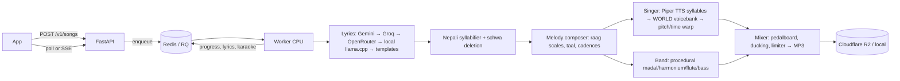

# Nepali Song Generator — Architecture, Decisions & Roadmap

## 1. The core idea in one paragraph

No GPU means no Suno-style end-to-end music model. So we split the song into
parts that are each cheap on a CPU and glue them together with classic DSP:

**free-tier LLM lyrics → rule-based melody composer that knows which syllable
sits on which note → Nepali TTS speaks each syllable once → WORLD vocoder turns
speech into singing (pitch, length, vibrato) → procedural Nepali band (madal,
harmonium, bansuri, bass) → pedalboard mix → MP3 on R2.**

Because we compose the melody ourselves, we get perfect lyric alignment and
**karaoke timings for free** — something even big AI music products struggle with.
That's the "magic" hook for the app.



## 2. Key decisions (and why)

| Problem | Decision | Why / alternatives rejected |
|---|---|---|
| Lyrics | Free-tier hosted LLMs via one OpenAI-compatible client, ordered fallback chain | Free tiers of Gemini/Groq/OpenRouter cost $0 and write far better Nepali than anything that fits on a CPU. Small local models (≤7B) often drift into Hindi. Local llama.cpp is only a fallback; a template composer guarantees we never fail. |
| LLM quota | Lyric-variant pool (6 per normalized request) | Viral prompts ("दसैँको गीत") stop hitting the LLM after 6 variants. |
| Melody | Rule-based composer (`composer.py`) | MusicGen/AudioCraft on CPU takes minutes per 10 s and can't align lyrics. Rules are instant, deterministic (seed → cache), and Nepali-specific (Kafi, Bhupali, Yaman; dadra/kaharwa grooves). |
| Singing voice | **Speech-to-singing with WORLD** on a self-building syllable voicebank | There's no open Nepali singing-voice model. Piper's `ne_NP` voice speaks each syllable once; WORLD separates pitch/timbre so we can impose any melody. Cached syllables make later songs nearly free. |
| Nepali phonetics | Own syllabifier: aksharas → word-final + medial schwa deletion → conjunct re-split | "घर" must be sung *ghar* (1 note) not *gha-ra*; "हिमालको" → *hi-maal-ko*; "जन्मदिन" → *jan-ma-din*. Verb endings (आउँछ) keep the schwa. `LEXICON` overrides exceptions. |
| Band | Procedural numpy synthesis | Madal/harmonium/bansuri aren't in General MIDI; no sample licensing; whole band renders in ~0.3 s. Optional FluidSynth + SoundFont upgrade and `assets/samples/*.wav` overrides for real recordings. |
| Mixing | Spotify `pedalboard` + ffmpeg | C++ effects, tiny CPU cost. Reverb + slap delay + ducking hide most vocoder artefacts. |
| Queue | Redis + RQ `SimpleWorker`; no-Redis in-process fallback | RQ is the simplest robust queue in Python. SimpleWorker (no fork) keeps the TTS model + voicebank warm. Fallback lets you run on a single HF Space with zero extra services. |
| Storage | Local or S3 API (Cloudflare R2 recommended) | R2 has no egress fees — songs get shared a lot. |
| Delivery | Poll `GET /v1/songs/{id}` or SSE `/events` | Lyrics + karaoke arrive within seconds; the app shows them while audio renders. |

## 3. CPU budget (measured with the real Piper ne_NP voice)

Measured in a 2-vCPU Linux sandbox, real `ne_NP-google-medium` voice,
end-to-end through FastAPI → Redis → RQ worker → MP3:

| Stage | Measured |
|---|---|
| Lyrics (hosted LLM) | network only; template fallback < 10 ms |
| Syllabify + compose | < 50 ms |
| Piper TTS per new syllable | 30–50 ms (+ WORLD analysis) |
| Singing, line mode (TTS + analysis ~0.5 s/line) | ~5–6 s per ~1 min song (harmony reuses the analysis) |
| Band | ~0.3 s |
| Mix + MP3 encode | ~3–4 s (largest stage; see optimisations) |
| **~1 min song, end to end** | **9–13 s** |

Lyrics + karaoke reach the app ~1 s after submit (they are written to the job
before singing starts). Voicebank: ~190 syllables = 6.5 MB on disk.
Pitch accuracy of the sung line: 100 % of notes within 50 cents of the score
(median error 3 cents). One 2-vCPU worker ≈ 300 songs/hour.

Cheap optimisations if you need more throughput: render harmony only for the
last chorus, lower WORLD synthesis to 16 kHz (the voice is 16 kHz anyway), use
`ffmpeg -q:a 4` VBR, and skip the WAV write by piping PCM to ffmpeg.

## 4. Quality — honest expectations

Voice facts (verified):
- `ne_NP-chitwan-medium`: **1 male speaker, 22 kHz, dataset licence CC0** → default
  production voice. Speech F0 ~140 Hz.
- `ne_NP-google-medium` (Hugging Face export): **18 female speakers, 22 kHz,
  CC-BY-SA-4.0**, speech F0 ~225–235 Hz. The older GitHub-release export is
  16 kHz and lacks nasal vowels; prefer the HF files.
- espeak keeps the final schwa in "घर" (*ghara*); our syllabifier's halanta
  trick fixes it (*ghar*).

### Singing v2: line mode (what fixed the "sounds like Chinese" problem)
v1 spoke each syllable in isolation → every syllable got its own sentence
intonation and no coarticulation, which listeners heard as a tonal language.
v2 (`line_singer.py`) speaks each **whole line** naturally, reads exact
per-phoneme durations from the VITS model (the ONNX graph's `Ceil` duration
tensor is exposed as an extra output, no aligner needed), maps phonemes to
sung syllables (one vowel nucleus each; matched 80/80 template lines for both
voices), then rebuilds the line on the melody timeline in one continuous WORLD
resynthesis. Two details matter: a throwaway word ("हो") is appended before
TTS so the real last syllable isn't devoiced like an utterance end, and every
vowel is loudness-levelled so unstressed vowels don't vanish when stretched.
Syllable mode remains as a per-line fallback.

Phase 1 sounds like a clean "vocaloid-style" singer over a light folk band:
clearly Nepali, clearly singing, on pitch, with vibrato and harmony — not a
human studio recording. Lean into it: brand the voice as a character
(e.g. "AI गायिका") so the synthetic timbre feels intentional. The biggest
quality jumps come from (in order): RVC timbre conversion, real instrument
samples, musician-written melody templates, and later a trained DiffSinger
voice (see roadmap).

What is **too heavy for CPU** and what we use instead:

| Heavy thing | Lighter alternative used |
|---|---|
| Suno/Udio-style text-to-song, MusicGen, Bark singing | Rule-based composer + WORLD singing |
| Training any voice model (RVC, DiffSinger, VITS) | Train once on free Kaggle/Colab GPU, run inference on CPU |
| Diffusion vocoders at high step counts | WORLD (Phase 1), NSF-HiFiGAN ONNX (Phase 3) |
| 70B local LLM | Free hosted APIs; 3–7B GGUF only as fallback |

## 5. Implementation plan

### Phase 1 — MVP (this repo, ~1–2 weeks solo)
1. `docker compose up` (or single-container inline mode), `scripts/download_voices.py`.
2. Get Gemini + Groq free keys; set `LLM_PROVIDERS`.
3. Run `scripts/prewarm.py` to build the voicebank.
4. **Listen and tune** with a Nepali speaker: fix syllabification exceptions in
   `nepali_text.LEXICON`, adjust `VoiceSpec.center_midi`/`length_scale`,
   review the template bank lyrics.
5. Ship app flow: prompt → editable lyrics preview (`/v1/lyrics`) → render →
   karaoke player → share.

### Phase 2 — Better quality (~3–6 weeks)
- **RVC "HD voice"**: train an RVC v2 model on 15–30 min of clean vocals from
  a consenting Nepali singer (written contract!) on a free Kaggle/Colab GPU.
  Run it on CPU after the WORLD singer as a timbre-conversion pass. CPU cost is
  much higher (expect tens of seconds to ~1–2 min per minute of audio) — offer it
  as an opt-in "HD" mode with its own queue.
- **Better coarticulation**: synthesize whole words/lines and split them with
  forced alignment (`torchaudio` MMS_FA runs on CPU and covers Nepali via
  romanization) instead of isolated syllables.
- **Melody templates by a musician**: pay a Nepali composer for 30–50 phrase
  templates per style (syllable-count-flexible). Composer picks/fits templates
  first, falls back to rules. Biggest authenticity win per rupee.
- **Real samples**: record madal, harmonium, bansuri, sarangi one-shots and
  phrases (drop into `assets/samples/`) or use CC0 packs; enable FluidSynth.
- **Lyrics**: few-shot examples per occasion, rhyme-repair pass using
  `rhyme_score`, Nepali profanity/abuse filter.
- More styles: Deuda, Selo, Ghazal, Rap-lok fusion; male + female voices.

### Phase 3 — Production (~2–3 months)
- **DiffSinger Nepali voicebank**: record 1–2 h of a professional singer,
  phoneme-label with Montreal Forced Aligner + a Nepali dictionary, train on
  rented/free GPU once, export ONNX, run acoustic model + NSF-HiFiGAN vocoder
  on CPU (shallow diffusion, few steps). Replace `Singer.render_note` with it —
  the composer's note/syllable score is already the right input format.
- Separate worker pools: fast (WORLD) vs HD (RVC/DiffSinger).
- Pre-generation calendar: render festival song packs before Dashain/Tihar/Teej;
  personalized versions re-sing only the lines containing the name.
- Moderation, abuse limits per device, observability (Sentry, Prometheus),
  CDN caching, signed URLs, GDPR-style deletion, paid tiers.

## 6. Deployment (free / cheap)

| Option | Fit | Notes |
|---|---|---|
| **Oracle Cloud Always Free ARM VM** | ★ Best free | Generous ARM cores/RAM; run full `docker-compose.yml`. Capacity can be hard to get in some regions. |
| Hugging Face Spaces (Docker, free CPU) | Great demo | Inline mode (no Redis), `PORT=7860`. Sleeps when idle; disk is ephemeral, so use R2 for songs. |
| Hetzner / similar 2–4 vCPU ARM VPS | ★ Best cheap paid | A few €/month; same compose file. |
| Railway / Render | OK | Usage-based or small paid instances; free tiers are too small or sleep. Needs 1 GB+ RAM. |
| Cloudflare Workers / Vercel | Not for the engine | No native Python audio libs and short CPU limits. Use them for the web frontend and R2 file serving only. |
| Redis | Upstash free tier or the compose `redis` | Only small JSON + queue data. |
| Files | Cloudflare R2 | Free 10 GB + free egress (check current terms). |

Free-tier limits change often — verify the current terms before relying on them.

Steps (Oracle/Hetzner VM):
```bash
sudo apt install docker.io docker-compose-plugin
git clone <your repo> && cd nepali-song-gen
cp .env.example .env   # fill keys, R2, API_KEYS
docker compose up -d --build
docker compose exec worker python scripts/prewarm.py
# put Caddy/nginx in front for HTTPS, or a Cloudflare Tunnel (free) - no open ports needed
```

## 7. Smart workarounds used

- **Self-building voicebank**: TTS → WORLD features per syllable, cached forever.
- **Variant pool** for lyrics: protects free LLM quotas.
- **Seeds everywhere**: same request + seed = identical song = cache hit.
- **Render fingerprint**: remixing back to a previous style is instant.
- **Remix endpoint** reuses lyrics; only the composer/band change.
- **Hook-as-intro**: the bansuri plays the chorus melody in the intro, so the
  song feels "composed" from the first second.
- **Duet chorus**: diatonic third harmony from the same voicebank, zero extra TTS.
- **Ducking + reverb + slap delay** mask vocoder artefacts.
- **Client-side lyric video**: the app renders a karaoke video from the
  karaoke JSON for Reels/TikTok — no server video rendering.

## 8. Licensing checklist (do this before launch)

| Component | Licence (verify current) |
|---|---|
| piper-tts | Older releases MIT; newer releases from `piper1-gpl` are GPL-3.0. Server-side use doesn't require releasing your source, but check with counsel. |
| Piper `ne_NP` voice | Read its MODEL_CARD — training-data licence applies. |
| pedalboard | GPL-3.0 (same server-side note). |
| pyworld / WORLD | MIT / modified BSD. |
| Meta MMS-TTS | CC-BY-NC 4.0 — **non-commercial only**. |
| edge-tts | Unofficial use of a Microsoft service — prototype only. |
| LLM free tiers | Free tiers may use prompts for training; disclose in your privacy policy. |
| Any singer you record | Written consent + voice-usage contract. |

## 9. App UX that makes it feel magical

1. Occasion chips (जन्मदिन, दसैँ, तिहार, तीज, माया, आमा, परदेश, लोरी) + "for whom?" name field.
2. Lyrics appear in ~3 s and are editable (`/v1/lyrics`), then "गाउनुहोस्" renders.
3. Progress narrated by stage: लेख्दै → धुन बनाउँदै → गाउँदै → बाजा बजाउँदै → मिक्स गर्दै.
4. Karaoke player highlighting each syllable/word using the returned timings.
5. One-tap style remix, and "share as lyric video".
